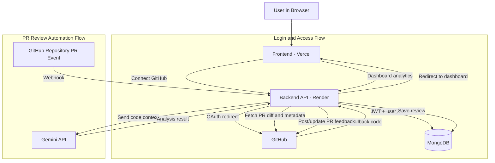

# Diffy

Diffy helps review GitHub Pull Requests using AI.

## What It Does

- Login with GitHub
- Show your repositories in a dashboard
- Let you connect repositories
- Add PR review automation using GitHub webhooks

## Tech Stack

- Frontend: React + Vite
- Backend: Node.js + Express
- Database: MongoDB
- AI: Gemini API

## Project Structure

- `Frontend/` - React app
- `Backend/` - Express API

## Architecture Diagram



## Local Setup

### 1. Clone and install

```bash
git clone https://github.com/kushagr-a/GitHub_Pr_Reviewer.git
cd GitHub_Pr_Reviewer

cd Backend
npm install

cd ../Frontend
npm install
```

### 2. Backend env (`Backend/.env`)

```env
PORT=3030
NODE_ENV=development

MONGO_URI=your_mongodb_uri
JWT_SECRET=your_jwt_secret

GITHUB_CLIENT_ID=your_github_client_id
GITHUB_CLIENT_SECRET=your_github_client_secret
GITHUB_CALLBACK_URL=http://localhost:3030/api/auth/github/callback
GITHUB_WEBHOOK_SECRET=your_webhook_secret

GEMINI_API_KEY=your_gemini_api_key

FRONTEND_URL=http://localhost:5173
CORS_ORIGIN=http://localhost:5173
```

### 3. Frontend env (`Frontend/.env`)

```env
VITE_API_URL=http://localhost:3030
```

### 4. Run app

```bash
# terminal 1
cd Backend
npm run dev

# terminal 2
cd Frontend
npm run dev
```

Open: `http://localhost:5173`

## GitHub OAuth Setup

Create an OAuth app in GitHub:

- Homepage URL: `http://localhost:5173`
- Callback URL: `http://localhost:3030/api/auth/github/callback`

Copy Client ID and Client Secret to `Backend/.env`.

## Production (Render + Vercel)

### Backend (Render)

Set these environment variables in Render:

```env
NODE_ENV=production
MONGO_URI=...
JWT_SECRET=...
GITHUB_CLIENT_ID=...
GITHUB_CLIENT_SECRET=...
GITHUB_CALLBACK_URL=https://your-backend.onrender.com/api/auth/github/callback
GITHUB_WEBHOOK_SECRET=...
GEMINI_API_KEY=...
FRONTEND_URL=https://your-frontend.vercel.app
CORS_ORIGIN=https://your-frontend.vercel.app
```

Do not force `PORT` on Render.

### Frontend (Vercel)

Set this variable in Vercel:

```env
VITE_API_URL=https://your-backend.onrender.com
```

## Notes

- After login, users are redirected to dashboard.
- Repository webhooks are managed from the dashboard connect/disconnect flow.
- If dashboard shows 400, check `VITE_API_URL`, `CORS_ORIGIN`, and OAuth callback URL.
